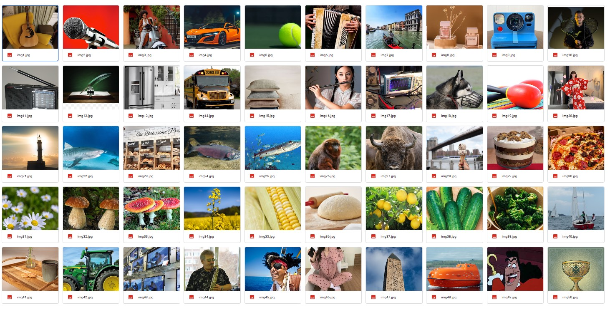
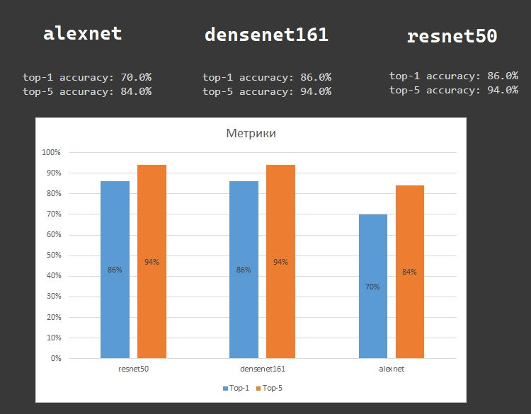
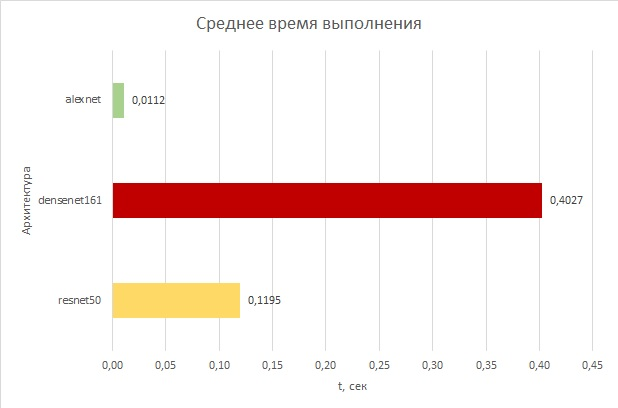
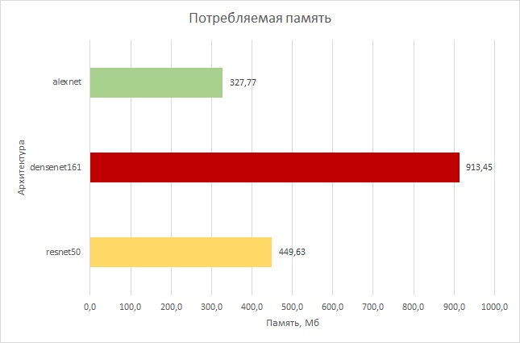
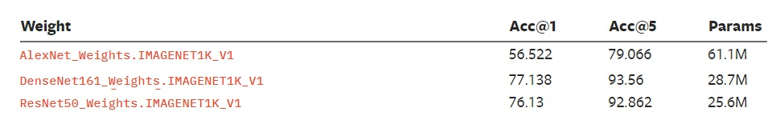

<h1 align="center">Лабораторная работа №3</h1>

<h2 align="center">Простые системы классификации изображений на
основе сверточных нейронных сетей</h2>

<p align="center"><b>Теоритическая база</b><p>

TorchVision предлагает предварительно обученные веса для каждой предоставленной архитектуры с использованием PyTorch Hub. PyTorch Hub поддерживает публикацию предобученных моделей (код модели + веса) в репозиторий на GitHub. Для этого нужно добавить в репозиторий один .py файл. В этом файле хранится список библиотек, которые нужны для обучения модели. Примеры таких файлов доступны для опубликованных в Hub-е моделей: torchvision, huggingface-bert и gan-model-zoo. Пользователю доступен следующий функционал:
- получить актуальный список опубликованных моделей;
- загрузить модель;
- получить список доступных методов для загруженной модели.

У опубликованной модели PyTorch Hub могут быть методы для предобработки. Например, у BERT есть метод для токенизации текстов.

<p align="center"><b>Описание разработанной системы</b><p>
Принцип работы состоит из пяти этапов:

1) Создание датасета.
2) Инициализация модели.
2) Инициализиция препроцессинга.
3) Использование препроцессинга для изображения.
4) Предсказывание класса предмета из изображения с помощью модели.
5) Вывод изображения с первыми 5-тью наиболее вероятными классами для предмета на изображении.

<b>Создание датасета</b>

Загружаем изображения с гугл диска и создаём список с предметом который присутствует на этих изображениях (всего 50 изображений).
```
images = []
for i in range(1,51):
  images.append(read_image(f"drive/MyDrive/dataset/img{i}.jpg").cuda())

text = ['acoustic guitar', 'microphone', 'moped', 'sports car', 'tennis ball', 'accordion', 'gondola', 'perfume', 'Polaroid camera', 'racket',
        'radio', 'quill', 'refrigerator', 'school bus', 'pillow', 'flute', 'oscilloscope', 'muzzle', 'maraca', 'kimono',
        'beacon', 'tiger shark', 'bakery', 'coho', 'barracouta', 'titi', 'bison', 'ice cream', 'trifle', 'pizza',
        'daisy', 'bolete', 'agaric', 'rapeseed', 'corn', 'dough', 'lemon', 'cucumber', 'broccoli','yawl',
        'tray', 'tractor', 'television', 'sax', 'pirate', 'pajama', 'obelisk', 'lifeboat', 'hook', 'goblet']
```
<figure>
  <p align="center"></p>
</figure>
<p align="center"><i>Наш датасет</i></p><br><br>

<b>Инициализация модели</b>

В качестве примера я использую архитектуру `resnet50`.
Сначала импортируем `resnet50` и её веса `ResNet50_Weights` из библиотеки `torchvision.models`. Далее присваем модели веса обученные на датасете `IMAGENET1K_V1`. И вызываем метод `eval()`, означающий, что мы сделаем прямой проход по модели не изменяя её веса (другими словами без обучения).

```
from torchvision.models import resnet50, ResNet50_Weights
weights = ResNet50_Weights.IMAGENET1K_V1
model = resnet50(weights=weights).cuda()
model.eval()
```
<b>Инициализиция препроцессинга</b>

Инициализируем препроцессинг, для того чтобы все изображения,которые мы будем передавать в модель, имели необходимый для её работы формат (размер, цветовой режим и тд.)
```
preprocess = weights.transforms()
```

<b>Использование препроцессинга для изображения</b>

Применяем препроцессинг для каждого изображения.
```
batch = preprocess(images[i]).unsqueeze(0)
```
<b>Предсказывание класса предмета из изображения с помощью модели</b>

Делаем предсказание и записываем в переменную `prediction`.
Возвращаем в переменную `top_prediction` тензор из 5-ти наиболее вероятных классов для предмета на изображении. 
Создаём список `top_prediction_idx`, доставая из тензора индексы 5-ти наиболее вероятных классов. 
Создаём список `all_score`, в которых будет хранится вероятность для каждого из 5-ти наиболее вероятных классов. 
Создаём список `category_names`, в который запишем имена 5-ти наиболее вероятных классов. 
Далее создадим список `array_description`, содержащий описание для каждого изображения, и сохраним этот список в общий список `description` всего датасета.
```
prediction = model(batch).squeeze(0).softmax(0)
top_prediction = torch.topk(prediction.flatten(), N_top_predition).indices
top_prediction_idx = [e.item() for e in top_prediction]
all_score = [prediction[e].item() for e in top_prediction_idx]
category_names = [weights.meta["categories"][e] for e in top_prediction_idx]
array_description = [f"{top_prediction_idx[e]} {category_names[e]}: {100 * all_score[e]:.1f}%" for e in range(N_top_predition)]
description.append("\n".join(array_description))
```
<b> Вывод изображения с первыми 5-тью наиболее вероятными классами для предмета на изображении</b>

С помощью библиотеки matplotlib выведем поочерёдно все изображения с их описаниями. 
```
from matplotlib import pyplot as plt
import numpy as np
import torchvision.transforms as T

transform = T.Resize((500,500))

if type(images[0]) == torch.Tensor:
  images = [i.cpu() for i in images]
  images = [transform(i).data.numpy().transpose((1,2,0)) for i in images]
  
for i in range(len(images)):

  fig = plt.figure(i,figsize=(10.8, 4.8))
  fig.suptitle(f"{text[i]}", fontsize=25, y=0.95)

  # Левая картинка
  ax1 = fig.add_subplot(121)
  ax1.imshow(np.full((images[i].shape[0],images[i].shape[1],3), 255, dtype= 'uint8'))

  left, width = 0, images[i].shape[1]
  bottom, height = 0, images[i].shape[0]
  right = left + width
  top = bottom + height

  ax1.text(0.5 * (left + right), 0.5 * (bottom + top), 
        description[i],
        verticalalignment  = 'center', #  вертикальное выравнивание
        multialignment = 'left', #  текст начинается слева
        horizontalalignment = 'center',    #  горизонтальное выравнивание
        color = 'black',
        fontsize = 16)
  ax1.axis('off')

  # Правая картинка
  ax2 = fig.add_subplot(122)
  ax2.imshow(images[i])
  ax2.set_xticks([]),ax2.set_yticks([])

plt.show()
```
<figure>
  <p align="center"></p>
</figure>
<p align="center"><i>Вывод результата (только первые два изображения)</i></p><br><br>


<p align="center"><b>Результаты работы и тестирования системы</b><p>
Протестируем 3 архитектуры сравнив их точность, скорость работы и потребление памяти.
Начнём тестирование с точности для этого мы напишем следующий код.
Для каждого изображения:

```
top1_accuracy += 1 if weights.meta["categories"][top_prediction_id[0]] == text[i] else 0
top5_accuracy += 1 if text[i] in [weights.meta["categories"][e] for e in top_prediction_id] else 0
```
Для вычисления итоговой точности модели:

```
top1_accuracy = top1_accuracy/len(images)
top5_accuracy = top5_accuracy/len(images)
print(f"top-1 accuracy: {100 * top1_accuracy:.1f}%")
print(f"top-5 accuracy: {100 * top5_accuracy:.1f}%")
```
Результат:

<figure>
  <p align="center"></p>
</figure>
<p align="center"><i>Метрики точности модели</i></p><br><br>

Далее протестируем среднее время выполнения подключив библиотеку `time` и создав с помощью неё список `test`.
```
import time
start = time.time()
prediction = model(batch).squeeze(0).softmax(0)
end = time.time()
test.append(end-start)
```
Результат:

<figure>
  <p align="center"></p>
</figure>
<p align="center"><i>Среднее время выполнения</i></p><br><br>

Последний параметр, который мы будем использовать для сравнения архитектур – это потребление памяти. Нам поможет встроенная бибилиотека Pytorch, которая называется `torch.profiler`. Для "профилирования" архитектуры используем следующий код: 
```
from torch.profiler import profile, record_function, ProfilerActivity
with profile(activities=[ProfilerActivity.CPU, ProfilerActivity.CUDA], record_shapes=True, profile_memory=True) as prof:
  with record_function("model_inference"):
    prediction = model(batch).squeeze(0).softmax(0)
print(prof.key_averages().table(sort_by="cuda_memory_usage", row_limit=None))
```
Результат:

<figure>
  <p align="center"></p>
</figure>
<p align="center"><i>Потребление памяти</i></p><br><br>

<h4 align="center">Выводы по работе</h4>

Вывод: Рассмотрев три архетектуры (`resnet50`, `alexnet`, `densenet161`), мы можем сделать вывод, что наиболее точные из них это `resnet50`, `densenet161`. Конечно это зависит от нашего датасета, скорее всего точность этих двух моделей отличается, однако мы можем предположить, что она примерно одинаковая. Хотя `alexnet` не такая точная как остальные архитектуры, она имеет явное преимущество в скорости выполнения, а так же в количестве потребляемой памяти.

P.S. Для адекватного сравнения архитектур можем посмотреть на документацию PyTorch.
<figure>
  <p align="center"></p>
</figure>
<p align="center"><i>Документация PyTorch</i></p><br><br>
